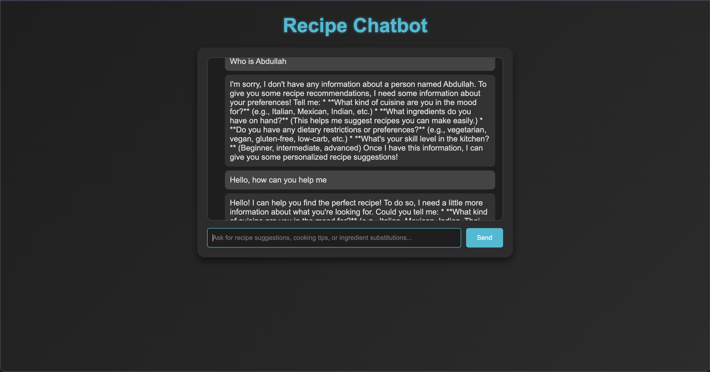

# Recipe Chatbot



## Introduction

This is a recipe chatbot that answers questions about recipes, ingredients, and cooking instructions. It leverages the Gemini AI model to generate helpful and accurate responses based on user input.

The chatbot uses the MeTTa language for context fetching and pattern mining. By integrating AI with hypergraph-based data representation, it provides context-aware and relevant answers.

If you are not familiar with the MeTTa programming language, check the [documentation](https://metta-lang.dev/).

## How It Works

1. The user submits a prompt via the UI.
2. The AI model parses the input and extracts important context such as ingredients, cuisine, dietary preferences, etc., and returns it as JSON.
3. Relevant information is fetched from the MeTTa data using helper functions.
4. The fetched data is supplied back to the LLM to generate a final response.

## Features

- Answers questions about recipes, ingredients, and cooking methods.
- Can provide user-specific answers using a MeTTa hypergraph.
- Interactive UI for a seamless user experience.

## Technologies Used

- **AI:** Gemini
- **Backend:** Django
- **Frontend:** HTML, CSS, JavaScript
- **Context Fetching:** MeTTa

## Gemini Integration & MeTTa Hypergraph Scheme Design

- **Gemini Integration Step:**  
  The chatbot leverages Google's Gemini AI for natural language understanding and response generation. Integration involves setting up API keys and configuring the backend to route user queries through Gemini, ensuring contextually rich and accurate answers.

- **MeTTa Hypergraph Scheme Design:**  
  The system uses a hypergraph-based scheme designed in MeTTa to represent complex relationships between recipes, ingredients, and user preferences. This enables flexible context fetching and advanced pattern mining, making the chatbot's responses more relevant and personalized.


## How to Run

1. **Clone the repository:**
    ```bash
    git clone <repository-url>
    cd recipe_chatbot
    ```

2. **Set up a virtual environment:**
    ```bash
    python -m venv venv
    source venv/bin/activate  # On Windows: venv\Scripts\activate
    ```

3. **Install dependencies:**
    ```bash
    pip install -r requirements.txt
    ```

4. **Run migrations:**
    ```bash
    python manage.py migrate
    ```

5. **Start the development server:**
    ```bash
    python manage.py runserver
    ```

6. **Access the application:**
    Open your browser and go to [http://127.0.0.1:8000](http://127.0.0.1:8000)

## Important Files

- `views.py` – Contains the main logic for the backend.
- `data.metta` – Stores data in MeTTa format and functions for mining complex relationships and providing context to the AI.
- `utils.py` – Handles integration between MeTTa and Python.
